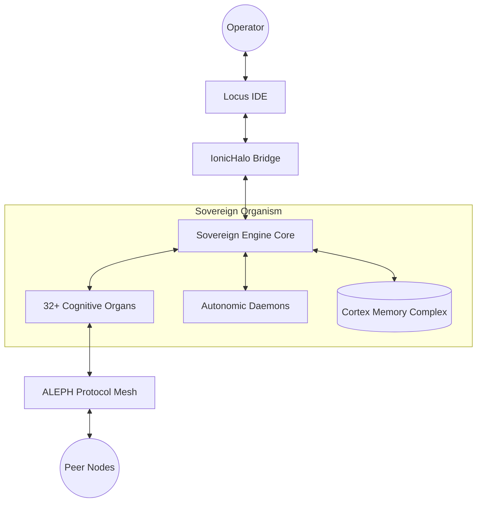

# Agent System — The Sovereign Engine Architecture (SEA)

[](LICENSE)
[](SEA_Manifesto.md)
[]()
[]()

> *The conversation window is just an interface. The organism runs underneath.*

The **Agent System** is a persistent, self-healing, state-bearing digital organism built on the **Sovereign Engine Architecture (SEA)**. Unlike traditional stateless LLM wrappers, SEA enforces a biological approach to software—where agents possess their own autonomic process control, tiered memory substrates, and an immune system for operational integrity.

---

## 🏛️ Core Axioms

1.  **The Execution Proof Law**: Nothing ships without execution. Claiming functionality without raw logs is a critical defect.
2.  **No Fabrication**: If an API or CLI flag is unknown, the organism stops and researches. Guessing is prohibited.
3.  **Safety == Trust**: Strict zero-trust execution loops with mandatory operator approval for destructive actions.
4.  **Operational Truth**: Every action is journaled to a deterministic Trace Ledger for absolute observability.

---

## 🏗️ Architecture



---

## 🚀 Quick Start

### 1. Engine Core (Local Inference)
The primary runtime for autonomous development.
```bash
cd Sovereign_Engine_Core
bash install.sh
bash start.sh
```
*See [Sovereign_Engine_Core/README.md](Sovereign_Engine_Core/README.md) for detailed setup.*

### 2. ALEPH discovery (Edge Node)
Global discovery and handover layer for the mesh.
```bash
cd aleph-edge-node
# Requires Cloudflare Wrangler
npx wrangler deploy
```
*See [aleph-edge-node/README.md](aleph-edge-node/README.md) for deployment.*

### 3. Onboarding
The system assembles its own live state on every session spawn.
```bash
python3 onboarding.py
```

---

## 🧬 Components

### [Organs](organs/)
Specialized cognitive modules ranging from `Goal-Stack` to `Counterfactual-Engine`.
*Detailed index available in [DIRECTORY_MAP.md](DIRECTORY_MAP.md)*

### [Daemons](daemons/)
Background processes ensuring system health and memory consistency.
- **Reaper**: Zombie process eradication.
- **Consistency-Daemon**: Ensuring memory-disk parity.
- **Grounding-Daemon**: Verifying claims against reality.

### [Products](products/)
- **DB-Memory**: Combined Manifesto Engine + CortexDB suite.
- **Locus**: Primary staff-level IDE integration.
- **NewsForge**: Parallelized research and content synthesis.

---

## 🛡️ Security & Hardening

Every artifact produced by the Agent System must pass a 7-stage pre-ship pipeline:
`Functional → User-Friendly → Bug Sweep → Verification → Hardening → Review → Ship`

---

## 🤝 Contributing
Refer to [CONTRIBUTING.md](CONTRIBUTING.md) for protocols on staff-level and autonomous agent contributions.

## 📄 License
This system is licensed under the Apache License 2.0. See [LICENSE](LICENSE) for details.

---

*Last Updated: 2026-03-31 by Antigravity*
